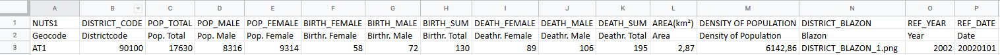
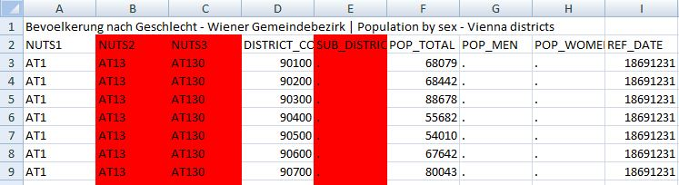
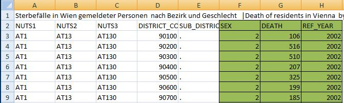
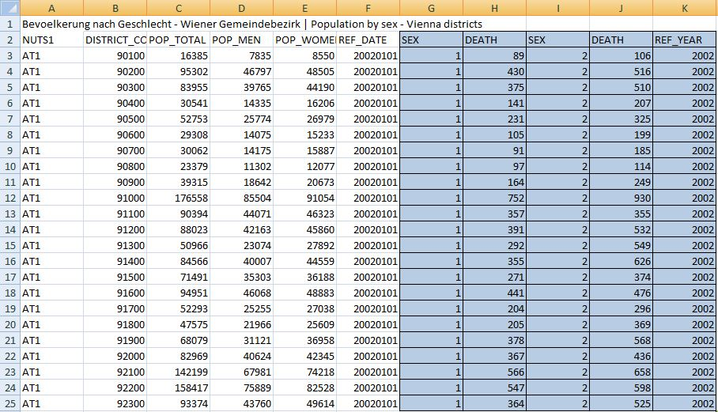
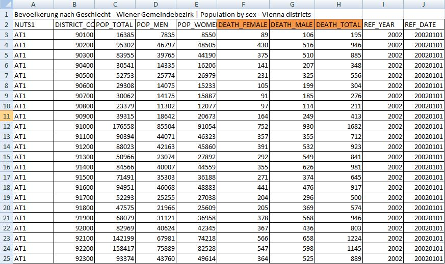

# Vienna-Visualisation
The goal of "Vienna-Visualisation" is to create different visualizations with open data from the city of Vienna to gain new insights, about specific aspects/topics.

## 1 - DataFinding/Gathering
Since this visualisation is mainly focused on the location Vienna, there are rarely any sources to get data from.
We used the website (https://digitales.wien.gv.at/site/open-data/) as our main source, because we managed to get there qualitative good data with no empty or corrupted entries. But even on this platform, which is provided by the government, there are so many different data structures (mostly attributes are not really uniformly standardized). So if you want to create a combined data set (so you have more data to compare) you have to create it by hand. This is explained in 2. 
Hint: Overall it’s very hard to find datasets, which will work right on, so you have to put in a lot of effort to find and create it on your own. 

## 2 - DataStructure
The server of "Vienna-Visualisation" accepts only a certain format to process the data correctly.
First of all the data should be provided in the **CSV** data format.
Then there has to be a basic structure passed into the server that needs at least 5 entrys to work.
 This entrys are:  **NUTS1**; **District Code**; at least one **Attribute**;( there can be additional entries) ; **Year**; **Date**.
This entry structure has to be always provided otherwise it will not work.
To make the designing process understandable and comprehensible, we created an example for the dataset "population". In this data set there are 16 entries. They are briefly described via the following picture.

  The first row is a standardized description from the "digitales Wien" website.  
  The second row is for the labeling in the visualisation.
  The third row (and further)are the actual data entries.
  To explain the first row in more detail - every column in the picture is assigned to a certain letter.< 
 **A**-NUTS1: This is an international geocode standard. There are more detailed NUTS codes but NUTS1 is enough for our Vienna visualisation.  (https://en.wikipedia.org/wiki/Nomenclature_of_Territorial_Units_for_Statistics)
 **B**: District Code: This is the code for the districts in Vienna, e.g: 90100 -> 901 is first district, 902 second one,...; 00 at the end of every entry are subdivisions inside the districts, which are irrelevant for us.
 **C** to **K**: This are the selected attributes we wanted to show, since we focused on population relevant stats, we used  Pop_Total,Pop_Female,...
 **L**: Area (in km²) This entry is manually added with the area informations from    (https://de.wikipedia.org/wiki/Wiener_Gemeindebezirke).
 **M**: Density of population, this is also manually added in the data set, it's just a calculation "Pop_Total/Area".
 **N**: Discrict_Blazon - this are all 23 blazons from the districts. Everyone of this 23 blazons pictures has be located on the server   (https://www.vienna.at/features/bezirke-wien).
 **O**: Is the year of the entries. 
 **P**: Is the date of the entries(more detailed - all 12 months of the year).

As you see **A-K** and **O-P** are build to together for different CSV-Tables to get a more meaningful visualisation (showed in 3). Further you can easily add data that supports you visualisation. Most of the time the data sets you find will not have every information you seek, but sometimes they can be easily added in the table. But keep in mind to provide sources for your data. In our example we added the data of **L-N** manually, because we think it will give a better insight in our presented data.

## 3 - Mergin CSV Tables
To give a preview about the table merging, we'll show this process with the CSV sets used in our visualisation "Bevölkerung seit 1869 Wien" and "Sterbefälle seit 2002 - Gemeindebezirke Wien". (https://digitales.wien.gv.at/site/open-data/)

First we look at the data we want and delete unnecessary attributes in "Bevölkerung seit 1869 Wien"
So in this case we delete NUTS2,NUTS3 and SUB_District_Code 

 Also we have to cut away all rows from the start till January 2002, because we have for all other datasets only detailed inforamtions since 2002.
 In the next step, will take the attributes we need from the "Sterbefälle seit 2002 - Gemeindebezirke Wien“, because all the other inforamtions stay the same.
 So we take the Sex, Death and Ref_Year and add it in the other datasheet.

 But we have now entries that show Sex "1" = female and Sex "2" = Male.
 So we take and copy all of that data sets with Sex = "1" for 2002 next to Sex = "2"
 It should look like this now:

  Now we merge the different genders to the according death columns and get two new columns "Death_Female" and "Death_Male".
  To get the Death_Sum we just add the male and female deaths together and put it into a new coloum.
  Now we rearrange our data set so it fits in the specification from 2. In the end we get a dataset, which looks like this.

  To complete the whole data set is pretty straight forward now, it's just adding attributes like in the example above.

## 4 - Future datasets
We hope that we can provide a good starting point for other topics with our visualisation.
